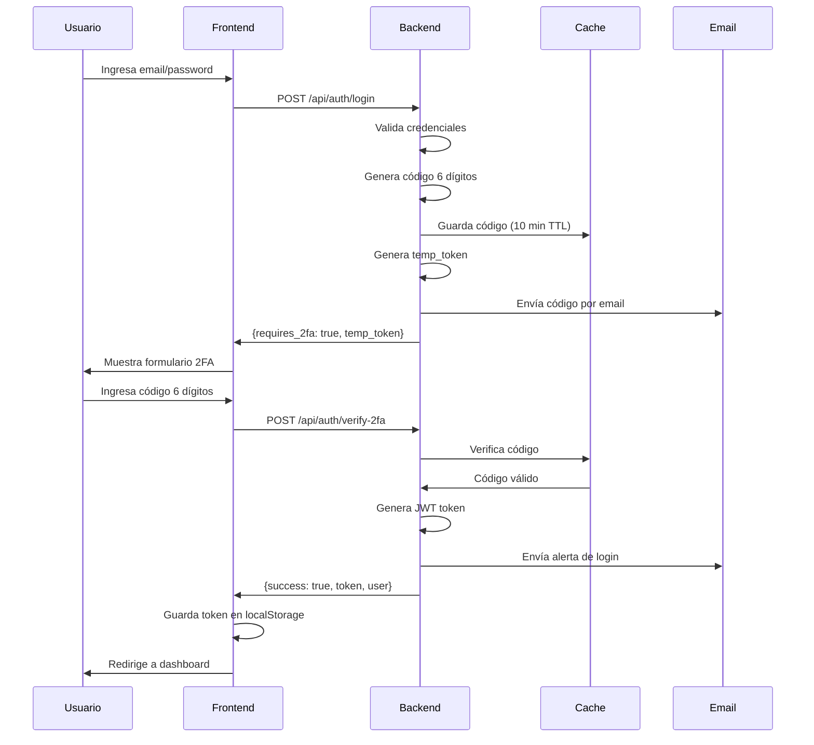
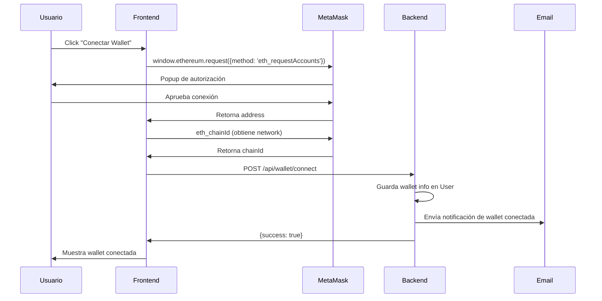

# 📚 Documentación Técnica - EagleInvest Platform

## 📋 Tabla de Contenidos

1. [Arquitectura General](#arquitectura-general)
2. [Stack Tecnológico](#stack-tecnológico)
3. [Estructura del Proyecto](#estructura-del-proyecto)
4. [Servicios Frontend (Angular)](#servicios-frontend-angular)
5. [Controladores Backend (Laravel)](#controladores-backend-laravel)
6. [Modelos de Datos](#modelos-de-datos)
7. [Flujos de Autenticación](#flujos-de-autenticación)
8. [API Endpoints](#api-endpoints)
9. [Guía de Desarrollo](#guía-de-desarrollo)
10. [Convenciones de Código](#convenciones-de-código)

---

## 🏗️ Arquitectura General

### Diagrama de Arquitectura

```
┌─────────────────────────────────────────────────────────────┐
│                     FRONTEND (Angular 18)                    │
│  ┌──────────────┐  ┌──────────────┐  ┌─────────────────┐   │
│  │  Components  │  │   Services   │  │     Guards      │   │
│  │  - Dashboard │  │  - Auth      │  │  - AuthGuard    │   │
│  │  - Wallet    │  │  - Portfolio │  │  - RoleGuard    │   │
│  │  - Market    │  │  - Market    │  └─────────────────┘   │
│  └──────────────┘  └──────────────┘                          │
└────────────┬────────────────────────────────────────────────┘
             │ HTTP/REST (JSON)
             │ Authorization: Bearer {token}
             ▼
┌─────────────────────────────────────────────────────────────┐
│                    BACKEND (Laravel 11)                      │
│  ┌──────────────┐  ┌──────────────┐  ┌─────────────────┐   │
│  │ Controllers  │  │    Models    │  │   Middleware    │   │
│  │  - Auth      │  │  - User      │  │  - Sanctum      │   │
│  │  - Wallet    │  │  - Investment│  │  - CORS         │   │
│  │  - Dashboard │  │  - Transaction│  └─────────────────┘   │
│  └──────────────┘  └──────────────┘                          │
└────────────┬────────────────────────────────────────────────┘
             │ Eloquent ORM
             ▼
┌─────────────────────────────────────────────────────────────┐
│                   DATABASE (MySQL/MariaDB)                   │
│  ┌──────────────────────────────────────────────────────┐   │
│  │  Tables:                                             │   │
│  │  - users                                             │   │
│  │  - investment_plans                                  │   │
│  │  - user_investments                                  │   │
│  │  - transactions                                      │   │
│  │  - withdrawals                                       │   │
│  │  - personal_access_tokens (Sanctum)                 │   │
│  └──────────────────────────────────────────────────────┘   │
└─────────────────────────────────────────────────────────────┘
```

### Flujo de Datos

1. **Frontend → Backend**: HTTP requests con JWT token en headers
2. **Backend → Database**: Eloquent ORM queries
3. **Backend → Frontend**: JSON responses con datos estructurados
4. **Cache Layer**: Redis/File cache para datos de mercado y sesiones 2FA

---

## 🛠️ Stack Tecnológico

### Frontend
- **Framework**: Angular 18 (Standalone Components)
- **Lenguaje**: TypeScript 5.4+
- **Estado**: Signals (Angular Signals API)
- **HTTP**: HttpClient con Interceptors
- **Routing**: Angular Router con Guards
- **Estilos**: CSS3 con custom properties (variables CSS)
- **Iconos**: Bootstrap Icons
- **Animaciones**: CSS transitions y Angular animations

### Backend
- **Framework**: Laravel 11
- **Lenguaje**: PHP 8.2+
- **Autenticación**: Laravel Sanctum (Token-based)
- **Base de Datos**: MySQL 8.0 / MariaDB 10.6+
- **ORM**: Eloquent
- **Cache**: Redis (opcional) / File
- **Email**: Laravel Mail con Blade templates
- **Validación**: Laravel Validation

### Infraestructura
- **Servidor Web**: Apache 2.4+ / Nginx
- **Node.js**: v20.x (para build frontend)
- **Composer**: v2.x (gestión dependencias PHP)
- **npm**: v10.x (gestión dependencias JS)

---

## 📁 Estructura del Proyecto

```
EAGLEINVEST/
│
├── eagleinvest-frontend/          # Aplicación Angular
│   ├── src/
│   │   ├── app/
│   │   │   ├── components/         # Componentes de UI
│   │   │   │   ├── dashboard/      # Dashboard principal
│   │   │   │   ├── wallet/         # Gestión de wallets crypto
│   │   │   │   ├── transactions/   # Historial de transacciones
│   │   │   │   ├── profile/        # Perfil de usuario
│   │   │   │   ├── market-overview/# Vista de mercado
│   │   │   │   └── shared/         # Componentes compartidos
│   │   │   │       ├── navbar/     # Barra de navegación
│   │   │   │       └── notification-toast/
│   │   │   │
│   │   │   ├── services/           # Servicios de lógica de negocio
│   │   │   │   ├── auth.service.ts           # Autenticación y sesión
│   │   │   │   ├── portfolio.service.ts      # Gestión de portafolio
│   │   │   │   ├── wallet.service.ts         # Operaciones de wallet
│   │   │   │   ├── market-data.service.ts    # Datos de mercado
│   │   │   │   ├── dashboard.service.ts      # Dashboard data
│   │   │   │   └── notification.service.ts   # Notificaciones
│   │   │   │
│   │   │   ├── guards/             # Route guards
│   │   │   │   └── auth.guard.ts   # Protección de rutas
│   │   │   │
│   │   │   ├── interceptors/       # HTTP interceptors
│   │   │   │   └── auth.interceptor.ts  # Inyección de token JWT
│   │   │   │
│   │   │   ├── app.ts              # Componente raíz
│   │   │   ├── app.routes.ts       # Configuración de rutas
│   │   │   └── app.config.ts       # Configuración global
│   │   │
│   │   ├── styles/                 # Estilos globales
│   │   └── main.ts                 # Bootstrap de Angular
│   │
│   ├── angular.json                # Configuración de Angular CLI
│   ├── package.json                # Dependencias npm
│   └── tsconfig.json               # Configuración TypeScript
│
├── eagleinvest-api/               # Backend Laravel
│   ├── app/
│   │   ├── Http/
│   │   │   └── Controllers/        # Controladores HTTP
│   │   │       ├── Api/
│   │   │       │   ├── AuthController.php          # Autenticación con 2FA
│   │   │       │   ├── DashboardController.php     # Dashboard data
│   │   │       │   └── MarketDataController.php    # Datos de mercado
│   │   │       ├── WalletController.php            # Gestión wallets
│   │   │       └── TwoFactorController.php         # 2FA verificación
│   │   │
│   │   ├── Models/                 # Modelos Eloquent
│   │   │   ├── User.php            # Modelo de usuario
│   │   │   ├── InvestmentPlan.php  # Planes de inversión
│   │   │   ├── UserInvestment.php  # Inversiones de usuarios
│   │   │   ├── Transaction.php     # Transacciones
│   │   │   └── Withdrawal.php      # Retiros
│   │   │
│   │   └── Providers/              # Service providers
│   │       └── AppServiceProvider.php
│   │
│   ├── config/                     # Archivos de configuración
│   │   ├── auth.php                # Configuración autenticación
│   │   ├── database.php            # Configuración BD
│   │   ├── mail.php                # Configuración email
│   │   ├── sanctum.php             # Configuración Sanctum
│   │   └── cors.php                # Configuración CORS
│   │
│   ├── database/
│   │   ├── migrations/             # Migraciones de BD
│   │   └── seeders/                # Seeders de datos iniciales
│   │
│   ├── resources/
│   │   └── views/
│   │       └── emails/             # Templates de email
│   │           ├── 2fa-code.blade.php
│   │           ├── login-alert.blade.php
│   │           └── wallet-connected.blade.php
│   │
│   ├── routes/
│   │   ├── api.php                 # Rutas de API
│   │   └── web.php                 # Rutas web
│   │
│   ├── .env                        # Variables de entorno
│   ├── composer.json               # Dependencias Composer
│   └── artisan                     # CLI de Laravel
│
└── DOCUMENTACION_TECNICA.md        # Este archivo
```

---

## 🔧 Servicios Frontend (Angular)

### AuthService
**Ubicación**: `src/app/services/auth.service.ts`

**Responsabilidades**:
- Gestión de autenticación de usuarios
- Manejo de sesiones con JWT tokens
- Flujo de autenticación de dos factores (2FA)
- Mantener estado de usuario reactivo con Signals

**Métodos principales**:

```typescript
/**
 * Registra un nuevo usuario
 * @param name - Nombre completo
 * @param email - Email único
 * @param password - Contraseña
 * @param password_confirmation - Confirmación de contraseña
 * @returns Observable<AuthResponse>
 */
register(name, email, password, password_confirmation): Observable<AuthResponse>

/**
 * Inicia sesión con soporte 2FA
 * @param email - Email del usuario
 * @param password - Contraseña
 * @returns Observable<AuthResponse> - Incluye requires_2fa y temp_token
 */
login(email, password): Observable<AuthResponse>

/**
 * Verifica código 2FA
 * @param tempToken - Token temporal del login
 * @param code - Código de 6 dígitos
 * @returns Observable<AuthResponse> - Token permanente si exitoso
 */
verify2FA(tempToken, code): Observable<AuthResponse>

/**
 * Reenvía código 2FA
 * @param tempToken - Token temporal activo
 */
resend2FA(tempToken): Observable<any>

/**
 * Cierra sesión del usuario
 */
logout(): void
```

### PortfolioService
**Ubicación**: `src/app/services/portfolio.service.ts`

**Responsabilidades**:
- Obtener datos del portafolio de inversiones
- Consultar análisis de mercado
- Gestionar historial de transacciones

**Interfaces principales**:

```typescript
interface Investment {
  id: number;
  symbol: string;           // BTC, ETH, AAPL
  name: string;
  quantity: number;
  purchase_price: number;
  current_price: number;
  value: number;           // quantity * current_price
  change: number;          // Ganancia/pérdida absoluta
  change_percentage: number;
}

interface Portfolio {
  id: number;
  total_value: number;
  invested_amount: number;
  total_return: number;
  return_percentage: number;
  daily_change: number;
  daily_change_percentage: number;
  last_updated: string;
  investments: Investment[];
}
```

### WalletService
**Ubicación**: `src/app/services/wallet.service.ts`

**Responsabilidades**:
- Conectar/desconectar wallets de criptomonedas
- Consultar información de wallet conectada
- Soporte para MetaMask, WalletConnect, etc.

---

## 🎛️ Controladores Backend (Laravel)

### AuthController
**Ubicación**: `app/Http/Controllers/Api/AuthController.php`

**Endpoints**:

```php
/**
 * POST /api/auth/login
 * Inicia sesión con 2FA
 * 
 * Request:
 * {
 *   "email": "user@example.com",
 *   "password": "password123"
 * }
 * 
 * Response:
 * {
 *   "success": true,
 *   "requires_2fa": true,
 *   "temp_token": "abc123xyz...",
 *   "message": "Código enviado a tu correo"
 * }
 */
public function login(Request $request)
```

### TwoFactorController
**Ubicación**: `app/Http/Controllers/TwoFactorController.php`

**Flujo 2FA**:
1. Usuario hace login → genera código 6 dígitos
2. Código guardado en cache por 10 minutos
3. Email enviado con código
4. Usuario ingresa código → verifica contra cache
5. Si válido → genera token permanente

**Endpoints**:

```php
/**
 * POST /api/auth/verify-2fa
 * Verifica código 2FA
 * 
 * Request:
 * {
 *   "temp_token": "abc123...",
 *   "code": "123456"
 * }
 * 
 * Response:
 * {
 *   "success": true,
 *   "token": "jwt_token_here",
 *   "user": { ... },
 *   "message": "Autenticación completada"
 * }
 */
public function verify2FACode(Request $request)

/**
 * POST /api/auth/resend-2fa
 * Regenera y reenvía código 2FA
 */
public function resend2FACode(Request $request)
```

### WalletController
**Ubicación**: `app/Http/Controllers/WalletController.php`

**Endpoints**:

```php
/**
 * GET /api/wallet/{userId}
 * Obtiene información de wallet
 * 
 * Response:
 * {
 *   "address": "0x742d35Cc...",
 *   "network": "Ethereum Mainnet",
 *   "balance": "1.2345",
 *   "connected": true
 * }
 */
public function getWalletInfo($userId)

/**
 * POST /api/wallet/connect
 * Conecta una wallet
 * 
 * Request:
 * {
 *   "user_id": 1,
 *   "wallet_address": "0x742d35...",
 *   "network": "Ethereum Mainnet",
 *   "provider": "MetaMask"
 * }
 */
public function connectWallet(Request $request)

/**
 * POST /api/wallet/disconnect
 * Desconecta wallet
 */
public function disconnectWallet(Request $request)
```

### DashboardController
**Ubicación**: `app/Http/Controllers/Api/DashboardController.php`

**Responsabilidades**:
- Obtener datos agregados del dashboard
- Estadísticas de inversiones
- Transacciones recientes
- Información de perfil
- Datos de referidos

---

## 📊 Modelos de Datos

### User Model
**Campos principales**:

```php
class User extends Authenticatable
{
    protected $fillable = [
        'name',
        'email',
        'password',
        'phone_number',
        'address',
        'wallet_address',      // Dirección de wallet crypto
        'wallet_network',      // Ethereum, BSC, Polygon
        'wallet_provider',     // MetaMask, WalletConnect
        'wallet_balance',
    ];

    // Relaciones
    public function investments()     // HasMany UserInvestment
    public function transactions()    // HasMany Transaction
    public function withdrawals()     // HasMany Withdrawal
    public function referrals()       // HasMany User (self-referencing)
}
```

### InvestmentPlan Model
**Campos**:
- `name`: Nombre del plan
- `description`: Descripción
- `min_amount`: Monto mínimo
- `max_amount`: Monto máximo
- `daily_return_rate`: Tasa de retorno diaria (%)
- `duration_days`: Duración en días
- `risk_level`: Nivel de riesgo (Low, Medium, High)

### UserInvestment Model
**Campos**:
- `user_id`: ID del usuario
- `investment_plan_id`: ID del plan
- `amount`: Monto invertido
- `start_date`: Fecha de inicio
- `end_date`: Fecha de finalización
- `status`: Estado (active, completed, cancelled)
- `completed_days`: Días transcurridos
- `total_earned`: Total ganado hasta ahora

---

## 🔐 Flujos de Autenticación

### Flujo de Login con 2FA



### Flujo de Conexión de Wallet



---

## 🌐 API Endpoints

### Autenticación

| Método | Endpoint | Descripción | Auth |
|--------|----------|-------------|------|
| POST | `/api/auth/login` | Login con 2FA | No |
| POST | `/api/auth/register` | Registro de usuario | No |
| POST | `/api/auth/verify-2fa` | Verificar código 2FA | No |
| POST | `/api/auth/resend-2fa` | Reenviar código 2FA | No |
| POST | `/api/auth/logout` | Cerrar sesión | Sí |
| GET | `/api/auth/me` | Usuario actual | Sí |

### Dashboard

| Método | Endpoint | Descripción | Auth |
|--------|----------|-------------|------|
| GET | `/api/dashboard/{userId}` | Datos del dashboard | Sí |
| GET | `/api/investment-plans` | Planes disponibles | Sí |
| GET | `/api/transactions/{userId}` | Historial transacciones | Sí |
| GET | `/api/withdrawals/{userId}` | Historial retiros | Sí |
| POST | `/api/withdrawals` | Solicitar retiro | Sí |

### Wallet

| Método | Endpoint | Descripción | Auth |
|--------|----------|-------------|------|
| GET | `/api/wallet/{userId}` | Info de wallet | Sí |
| POST | `/api/wallet/connect` | Conectar wallet | Sí |
| POST | `/api/wallet/disconnect` | Desconectar wallet | Sí |

### Perfil

| Método | Endpoint | Descripción | Auth |
|--------|----------|-------------|------|
| GET | `/api/profile/{userId}` | Datos de perfil | Sí |
| PUT | `/api/profile/{userId}` | Actualizar perfil | Sí |

### Referidos

| Método | Endpoint | Descripción | Auth |
|--------|----------|-------------|------|
| GET | `/api/referrals/stats/{userId}` | Estadísticas | Sí |
| GET | `/api/referrals/{userId}` | Lista de referidos | Sí |

### Mercado

| Método | Endpoint | Descripción | Auth |
|--------|----------|-------------|------|
| GET | `/api/market/crypto-prices` | Precios crypto | No |
| GET | `/api/market/indices` | Índices de mercado | No |
| GET | `/api/market/news` | Noticias financieras | No |

---

## 🚀 Guía de Desarrollo

### Setup Frontend

```bash
cd eagleinvest-frontend

# Instalar dependencias
npm install

# Desarrollo con hot-reload
ng serve
# → http://localhost:4200

# Build para producción
ng build --configuration production
# → dist/eagleinvest-frontend/
```

### Setup Backend

```bash
cd eagleinvest-api

# Instalar dependencias
composer install

# Configurar .env
cp .env.example .env
php artisan key:generate

# Configurar base de datos en .env
DB_DATABASE=eagleinvest
DB_USERNAME=root
DB_PASSWORD=

# Ejecutar migraciones
php artisan migrate

# Seeders (datos de prueba)
php artisan db:seed

# Iniciar servidor
php artisan serve
# → http://127.0.0.1:8000
```

### Configuración CORS

En `config/cors.php`:

```php
'paths' => ['api/*', 'sanctum/csrf-cookie'],
'allowed_origins' => ['http://localhost:4200'],
'allowed_methods' => ['*'],
'allowed_headers' => ['*'],
'supports_credentials' => true,
```

### Configuración Email

En `.env`:

```env
MAIL_MAILER=smtp
MAIL_HOST=smtp.mailtrap.io    # Para desarrollo
MAIL_PORT=2525
MAIL_USERNAME=your_username
MAIL_PASSWORD=your_password
MAIL_ENCRYPTION=tls
MAIL_FROM_ADDRESS=noreply@eagleinvest.com
MAIL_FROM_NAME="EagleInvest"
```

---

## 📝 Convenciones de Código

### TypeScript (Frontend)

```typescript
// ✅ Usar interfaces para tipos
interface User {
  id: number;
  name: string;
}

// ✅ Signals para estado reactivo
const user = signal<User | null>(null);

// ✅ Inyección de dependencias con inject()
private authService = inject(AuthService);

// ✅ Nomenclatura:
// - Clases: PascalCase
// - Métodos/variables: camelCase
// - Constantes: UPPER_SNAKE_CASE
// - Interfaces: PascalCase con prefix I (opcional)

// ✅ Documentación JSDoc
/**
 * Descripción del método
 * @param {string} param1 - Descripción
 * @returns {Observable<Type>} - Qué retorna
 */
```

### PHP (Backend)

```php
// ✅ Usar type hints
public function login(Request $request): JsonResponse

// ✅ Validación con Request
$request->validate([
    'email' => 'required|email',
    'password' => 'required|min:8'
]);

// ✅ Nomenclatura:
// - Clases: PascalCase
// - Métodos: camelCase
// - Variables: snake_case (en BD), camelCase (en código)

// ✅ Documentación PHPDoc
/**
 * Descripción del método
 *
 * @param  Request  $request
 * @return JsonResponse
 * 
 * @throws ValidationException
 */
```

### Estilos CSS

```css
/* ✅ Variables CSS para colores del tema */
:root {
  --primary-cyan: #00F0FF;
  --primary-purple: #C946FF;
  --navy-dark: #0A0E27;
  --navy-light: #1A1F4D;
}

/* ✅ Nombres de clases descriptivos */
.btn-neon { }
.stat-card { }
.investment-card { }

/* ✅ Mobile-first con clamp() para responsive */
font-size: clamp(0.9rem, 2vw, 1.1rem);
```

### Git Commits

```bash
# ✅ Formato de commits
feat: Agregar autenticación 2FA
fix: Corregir cálculo de retornos
docs: Actualizar documentación API
style: Mejorar diseño de tablas
refactor: Optimizar servicio de portafolio
test: Agregar tests unitarios
chore: Actualizar dependencias
```

---

## 🧪 Testing

### Frontend (Angular)

```bash
# Tests unitarios
ng test

# Tests end-to-end
ng e2e

# Coverage
ng test --code-coverage
```

### Backend (Laravel)

```bash
# Tests unitarios
php artisan test

# Test específico
php artisan test --filter=AuthTest

# Coverage
php artisan test --coverage
```

---

## 🔒 Seguridad

### Checklist de Seguridad

- ✅ **CSRF Protection**: Laravel Sanctum
- ✅ **XSS Protection**: Sanitización de inputs
- ✅ **SQL Injection**: Eloquent ORM (prepared statements)
- ✅ **Password Hashing**: bcrypt (Laravel)
- ✅ **2FA**: Códigos de 6 dígitos con expiración
- ✅ **Rate Limiting**: Throttle en rutas API
- ✅ **HTTPS**: Requerido en producción
- ✅ **Token Expiration**: JWT con TTL configurable
- ✅ **Input Validation**: Laravel Validation

---

## 📦 Deployment

### Frontend (Angular)

```bash
# Build para producción
ng build --configuration production

# Archivos generados en dist/
# Subir a servidor web (Apache/Nginx)
# Configurar .htaccess para SPA routing
```

### Backend (Laravel)

```bash
# Optimizar para producción
composer install --optimize-autoloader --no-dev
php artisan config:cache
php artisan route:cache
php artisan view:cache

# Configurar permisos
chmod -R 775 storage bootstrap/cache
```

---

## 🐛 Debugging

### Frontend

```typescript
// Console logs en desarrollo
if (!environment.production) {
  console.log('Debug:', data);
}

// Angular DevTools (Chrome Extension)
// Redux DevTools para Signals
```

### Backend

```php
// Log de Laravel
\Log::info('Debug message', ['data' => $data]);

// Laravel Telescope (desarrollo)
composer require laravel/telescope --dev
php artisan telescope:install

// Laravel Debugbar
composer require barryvdh/laravel-debugbar --dev
```

---

**Versión**: 1.0.0  
**Última actualización**: Noviembre 24, 2025  
**Mantenido por**: EagleInvest Dev Team
